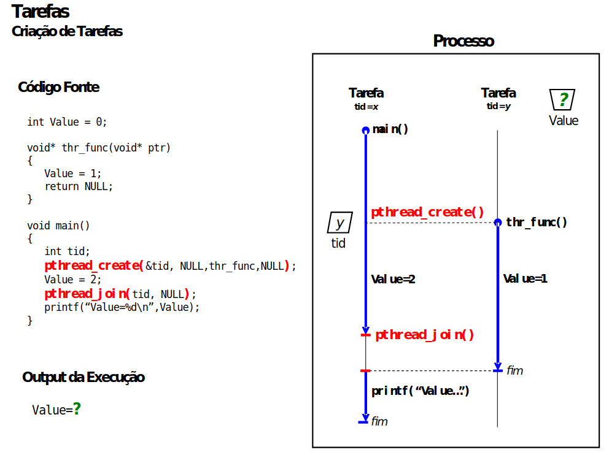

# Guião 4: Programação com processos e tarefas

  

## Objectivos

No final deste guião, deverá ser capaz de:

- compreender os conceitos programação paralela com processos e tarefas (que
é um dos requisitos essenciais do 1º exercício do projeto de SO)
- utilizar primitivas para a gestão de processos e tarefas como `pthread_create`, `pthread_join`, `fork` e `wait`.

*Nota: Os tutoriais práticos de SO consistem num conjunto de exercícios práticos que permitem aos alunos
familiarizarem-se com um determinado tema que será necessário para resolver os projetos da disciplina.
Os tutoriais podem ser resolvidos individualmente ou em grupo. A sua resolução é recomendada mas
não obrigatória. Não são avaliados.
Cada tutorial pressupõe que os exercícios são realizados numa interface de linha de comandos (shell) de
um sistema Unix/Linux ou equivalente. Assume também que os alunos já resolveram os tutoriais
anteriores.*

## Requisitos

- Sistema operativo Linux 20.04 LTS (se não o tiverem disponível no vosso computador pessoal, podem utilizar os computadores do laboratório);

## 1. Tarefas

Clone este repositório, usando o git: `git clone git@github.com:tecnico-so/lab_programacao-processos-tarefas`.

Aceda à diretoria com o comando:

```sh
cd lab_programacao-processos-tarefas
```

a) Na pasta `src` estude, compile e execute a aplicação. Consulte o diagrama na página seguinte deste guião e
compreenda o resultado do programa.

b) Porque razão diferentes execuções do programa podem resultar em diferentes valores para variável global `Value`?

c) Monte uma experiência que prove a afirmação da alínea b). 

*Sugestão: utilize a chamada sistema`sleep`.*

## 2. Processos

Componha um programa paralelo alternativo, em que as chamadas a `pthread_create` e `pthread_join`
são substituídas por chamadas a `fork` e `wait` (tenha o cuidado de assegurar que a função `wait` só é
chamada pelo processo pai).

Neste caso, o paralelismo acontecerá com processos distintos, e não com tarefas dentro do mesmo
processo. O que muda no resultado que este novo programa imprime no stdout?


