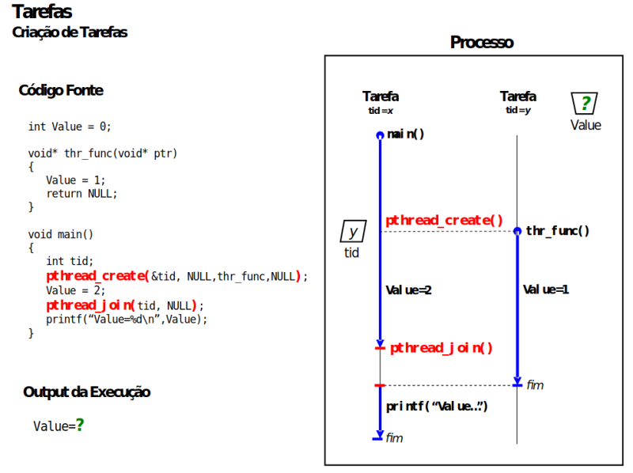

# Guião sobre programação com tarefas e processos

  

## Objetivos

No final deste guião, deverá ser capaz de:

* criar tarefas (*threads*) utilizando `pthread_create` e esperar pela sua terminação utilizando `pthread_join`;
* criar processos utilizando `fork` e esperar pela sua terminação utilizando `wait`;
* comparar a execução concorrente utilizando tarefas e processos.

## Introdução

Muitos programas precisam de executar várias funções ao mesmo tempo.
Por exemplo, uma aplicação pode estar a processar dados enquanto recebe novos comandos, outra pode querer dividir um cálculo entre vários processadores para chegar mais depressa ao resultado pretendido.
Um servidor pode querer atender vários pedidos ao mesmo tempo.

Em sistemas POSIX, existem dois mecanismos para criar execução concorrente: as **tarefas** (*threads*) e os **processos**.

As tarefas pertencentes ao mesmo processo partilham grande parte dos recursos desse processo, incluindo o seu espaço de endereçamento. 
Esta partilha facilita a comunicação entre tarefas, mas significa também que é necessário ter cuidado quando várias tarefas acedem simultaneamente aos mesmos dados.

Os processos, pelo contrário, possuem espaços de endereçamento separados. 
Depois de criar um novo processo, as alterações efetuadas na memória de um processo não modificam a memória do outro.

Neste guião vamos estudar primeiro dois exemplos de código e depois teremos um exercício.

### Antes de começar

Para os exemplos e o exercício vai precisar de um sistema operativo compatível com POSIX, de preferência um Unix, como o Ubuntu Linux ou outro.
Se ainda não o tiver disponível no seu computador pessoal, pode utilizar um dos computadores do laboratório.

Para obter os exemplos de código, clone este repositório, usando o comando: ``git clone https://github.com/tecnico-so/lab_tarefas-processos.git``

## 1. Tarefas

Uma tarefa (*thread* [^thread-fio]) é uma sequência de instruções que pode ser executada concorrentemente dentro de um processo.

[^thread-fio]: *thread* é fio em inglês.
Pode dizer-se também fio de execução.
Cada *thread* representa um percurso sequencial de execução através das instruções do programa, podendo coexistir vários "fios" num mesmo "tecido", correspondente à aplicação como um todo.

Comece por abrir o ficheiro `src/thread.c`.
Este programa cria várias tarefas utilizando a biblioteca POSIX Threads (*pthreads*).

### 1.1. Análise inicial

Antes de executar o programa:

**a)** Identifique as chamadas a [`pthread_create`](https://man7.org/linux/man-pages/man3/pthread_create.3.html) e determine quantas tarefas são criadas.

**b)** Identifique a função executada por cada nova tarefa.

**c)** Identifique os dados que são partilhados entre as tarefas.

**d)** Preveja a informação que deverá ser apresentada no terminal.

**e)** Para que serve a chamada a [`pthread_join`](https://man7.org/linux/man-pages/man3/pthread_join.3.html)?

### 1.2. Compilação e execução

Compile e execute o programa:

```console
cd src
make
./thread
```
Repita a execução várias vezes.

Compare os resultados observados com a previsão efetuada anteriormente.

### 1.3 Interpretação dos resultados

Consulte o seguinte diagrama:



As tarefas partilham a variável global `g_value`.

Porque razão diferentes execuções do programa podem produzir diferentes valores para `g_value`?

### 1.4. Influenciar a ordem de execução

Para tornar as diferentes ordens de execução mais fáceis de observar, introduza temporariamente chamadas a [`sleep`](https://man7.org/linux/man-pages/man3/sleep.3.html) em diferentes pontos do programa.

O objetivo é fazer uma chamada a `sleep` para suspender temporariamente a tarefa que a executa, dando a oportunidade para outras tarefas executarem.

Nota importante: O uso de `sleep` permite influenciar o comportamento observado, mas não constitui um mecanismo correto de sincronização entre tarefas.
Estes mecanismos de sincronização serão vistos mais tarde, noutros guiões.

----

## 2. Processos

Componha um programa paralelo alternativo, `process.c`, em que as chamadas a `pthread_create` e `pthread_join` são substituídas por chamadas a `fork` e `wait` (tenha o cuidado de assegurar que a função `wait` só é chamada pelo processo pai).

Neste caso, o paralelismo acontecerá com processos distintos, e não com tarefas dentro do mesmo processo.
O que muda no resultado que este novo programa imprime no *stdout*?


Vamos agora repetir parte da experiência utilizando processos em vez de tarefas.

Crie um novo programa, `process.c`, inicialmente tão simples quanto possível.

O programa deverá criar um processo filho utilizando `fork`.

### 2.1. A função `fork`

Consulte a documentação de [`fork`](https://man7.org/linux/man-pages/man2/fork.2.html):

```console
man 2 fork
```

Responda:

**a)** Quantos processos continuam a executar o código depois de uma chamada a `fork` que termine com sucesso?

**b)** Que valor é devolvido por `fork` no processo filho?

**c)** Que valor é devolvido no processo pai?

**d)** Que valor indica um erro?

### 2.2. Identificar pai e filho

Utilize `getpid()` para obter o identificador de cada processo.

Pode também utilizar `getppid()` para obter o identificador do processo pai.

Modifique o programa para que cada processo apresente uma linha semelhante a:

```text
processo 1234, pai 1200
```

Execute o programa várias vezes.

**a)** Identifique qual das linhas foi produzida pelo processo original e qual foi produzida pelo processo filho.

**b)** A ordem das duas linhas é sempre a mesma?

**c)** O processo pai pode assumir que executa primeiro apenas porque foi ele que chamou `fork`?

### 2.3. Esperar pela terminação de processos

O processo pai pode utilizar `wait` para esperar pela terminação de um dos seus processos filhos.

Consulte a documentação de [`wait`](https://man7.org/linux/man-pages/man2/wait.2.html):

```console
man 2 wait
```

Modifique `process.c` para que:

1. o processo pai crie um processo filho;
2. o filho apresente uma mensagem e termine;
3. o pai chame `wait`;
4. o pai apresente uma mensagem apenas depois de `wait` terminar.

Execute o programa várias vezes.

Confirme que a mensagem final do pai aparece sempre depois da mensagem produzida pelo filho.

## 3. Comparar tarefas e processos

**a)** Com base nos exemplos e experiências anteriores, complete a seguinte tabela:

| Característica                                                       | Tarefas          | Processos |
| -------------------------------------------------------------------- | ---------------- | --------- |
| Criação                                                              | `pthread_create` | `fork`    |
| Identificação                                                        | `pthread_t`      | PID       |
| Espera pela terminação                                               | `pthread_join`   | `wait`    |
| Espaço de endereçamento                                              | ?                | ?         |
| Variáveis globais diretamente partilhadas                            | ?                | ?         |

**b)** Qual é a diferença entre concorrência e paralelismo?

## Conclusão

Uma tarefa (*thread*) é um fio de execução dentro de um processo. 
Várias tarefas do mesmo processo partilham o espaço de endereçamento e podem, por isso, aceder diretamente às mesmas variáveis.
Esta partilha facilita a comunicação, mas cria também a possibilidade de acessos concorrentes incorretos.
O uso de atrasos, com sleep, permite influenciar a execução, mas **não** é um método fiável de sincronização.
Abordagens corretas serão vistas depois.

`pthread_create` permite criar uma nova tarefa e `pthread_join` permite esperar pela sua terminação.

Um processo criado por `fork` começa com um estado derivado do processo que o criou, mas executa num espaço de endereçamento separado. 
Alterações posteriores à memória do filho não alteram a memória do pai.

O processo pai pode utilizar `wait` para esperar pela terminação de um processo filho.

Tarefas e processos permitem, portanto, criar execução concorrente, mas possuem propriedades diferentes relativamente à partilha e ao isolamento de recursos.
A escolha de um ou outro vai depender da aplicação final.

----

Contactos para sugestões/correções: [LEIC-Alameda](mailto:leic-so-alameda@disciplinas.tecnico.ulisboa.pt), [LEIC-Tagus](mailto:leic-so-tagus@disciplinas.tecnico.ulisboa.pt), [LETI](mailto:leti-so-tagus@disciplinas.tecnico.ulisboa.pt)
